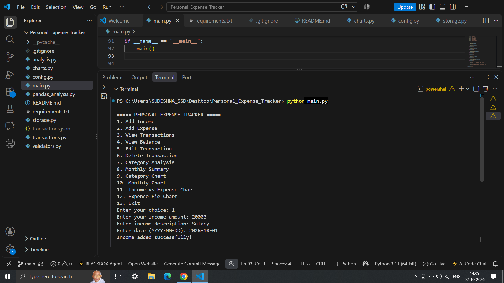
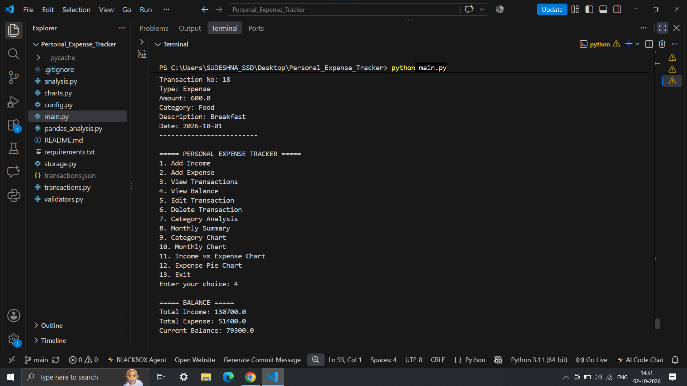
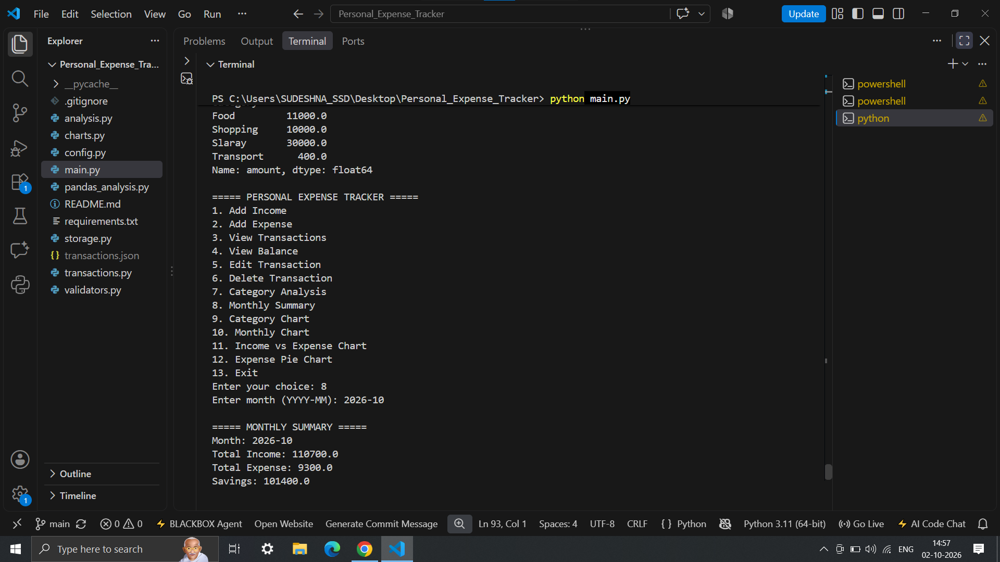
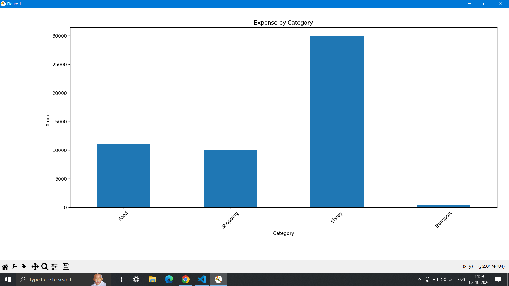

# Personal Expense Tracker

A modular command-line based personal expense management application developed using Python. The application allows users to manage income and expenses, maintain persistent transaction records, perform financial analysis, and generate data visualizations.

The project demonstrates practical Python development concepts including modular programming, JSON-based data persistence, input validation, exception handling, Pandas-based data analysis, and Matplotlib-based visualization.

## Overview

Personal Expense Tracker is designed to provide a simple and structured way to manage personal financial transactions.

The application supports:

- Adding income and expenses
- Viewing transaction history
- Editing and deleting transactions
- Tracking the current balance
- Categorizing expenses
- Generating monthly financial summaries
- Performing financial analysis using Pandas
- Generating financial charts using Matplotlib
- Persisting transaction data using JSON
- Handling invalid inputs and common data errors

The application is organized into multiple modules to improve code readability, maintainability, and separation of responsibilities.

## Screenshots

### Main Menu and Add Income


### Transactions and Balance


### Category Analysis and Monthly Summary


### Category-wise Expense Chart


## Features

### Transaction Management

- Add income
- Add expenses
- View all transactions
- Edit existing transactions
- Delete transactions
- Assign categories to transactions
- Maintain transaction dates
- Automatic transaction numbering

### Financial Analysis

- Calculate total income
- Calculate total expenses
- Calculate current balance
- Analyze expenses by category
- Generate monthly summaries
- Calculate monthly income, expenses, and savings

### Data Analysis

Pandas is used to convert transaction data into structured DataFrames and perform financial analysis.

The analysis includes:

- Income analysis
- Expense analysis
- Category-wise analysis
- Monthly analysis
- Overall financial summaries

### Data Visualization

Matplotlib is used to generate financial visualizations, including:

- Category-wise expense chart
- Monthly expense chart
- Income vs. expense chart
- Expense distribution pie chart

### Data Persistence

Transaction records are stored in JSON format, allowing data to persist between application sessions.

### Validation and Error Handling

The application includes validation and error-handling mechanisms for:

- Invalid transaction amounts
- Empty inputs
- Invalid dates
- Invalid menu selections
- Invalid transaction selections
- JSON file errors
- Unexpected user input

## Technology Stack

| Technology | Purpose |
|---|---|
| Python | Core application development |
| JSON | Persistent data storage |
| Pandas | Data analysis and processing |
| Matplotlib | Data visualization |
| datetime | Date handling and validation |

## Project Structure

```text
Personal_Expense_Tracker/
│
├── main.py
├── config.py
├── storage.py
├── validators.py
├── transactions.py
├── analysis.py
├── pandas_analysis.py
├── charts.py
│
├── screenshots/
│   ├── main-menu.png
│   ├── transactions-balance.png
│   ├── analysis.png
│   └── category-chart.png
│
├── requirements.txt
├── .gitignore
└── README.md
```

Note: `transactions.json` is generated locally when the application runs and is excluded from the public repository through `.gitignore`.

## Module Description

### main.py

Controls the overall application flow and manages the command-line menu.

### config.py

Contains application configuration and reusable constants.

### storage.py

Responsible for loading and saving transaction data using JSON.

### validators.py

Contains input validation functions for amounts, dates, empty inputs, and menu selections.

### transactions.py

Handles transaction-related operations:

- Adding income
- Adding expenses
- Viewing transactions
- Editing transactions
- Deleting transactions

### analysis.py

Performs financial calculations and analysis such as:

- Balance calculation
- Category-wise expense analysis
- Monthly financial summaries

### pandas_analysis.py

Uses Pandas to perform structured analysis of transaction data.

### charts.py

Uses Matplotlib to generate financial data visualizations.

## Application Workflow

```text
Start Application
       |
       v
   Main Menu
       |
       +-- Add Income
       |
       +-- Add Expense
       |
       +-- View Transactions
       |
       +-- Edit Transaction
       |
       +-- Delete Transaction
       |
       +-- View Balance
       |
       +-- Category Analysis
       |
       +-- Monthly Summary
       |
       +-- Generate Charts
       |
       v
      Exit
```

## Installation

### Prerequisites

- Python 3.x
- pip

### Clone the Repository

```bash
git clone https://github.com/sdey19-cyber/Personal-Expense-Tracker.git
```

### Navigate to the Project Directory

```bash
cd Personal-Expense-Tracker
```

### Install Dependencies

```bash
pip install -r requirements.txt
```

### Run the Application

```bash
python main.py
```

## Requirements

The project requires the following external Python libraries:

```text
pandas
matplotlib
```

Python standard library modules such as `json` and `datetime` are also used.

## Data Analysis

The project uses Pandas to process transaction records and generate structured financial insights.

Examples include:

```text
Total Income
Total Expenses
Savings
Category-wise Expenses
Monthly Expenses
```

This demonstrates the use of Python for both application development and structured data analysis.

## Data Visualization

The project uses Matplotlib to visualize financial data.

### Category-wise Expense Chart

Displays the distribution of expenses across different categories.

### Monthly Expense Chart

Displays expense patterns across different months.

### Income vs. Expense Chart

Provides a comparison between income and expenses.

### Expense Distribution Pie Chart

Displays the proportion of expenses across different categories.

## Python Concepts Demonstrated

This project applies the following Python concepts:

- Variables and data types
- Conditional statements
- Loops
- Functions
- Lists and dictionaries
- File handling
- JSON serialization and deserialization
- Exception handling
- Input validation
- Date handling
- Modular programming
- Data processing
- Pandas DataFrames
- Data visualization
- Multi-file project organization

## Data Privacy

Transaction data is stored locally in `transactions.json`.

Real personal financial information should not be committed to a public GitHub repository.

The `.gitignore` file is configured to exclude sensitive and unnecessary files such as:

```text
__pycache__/
*.pyc
.venv/
venv/
.env
transactions.json
```

## Future Improvements

Potential future extensions include:

- SQLite or PostgreSQL database integration
- Object-oriented architecture
- REST API using FastAPI
- Authentication and authorization
- SQLAlchemy integration
- Automated testing using Pytest
- Docker containerization
- Cloud deployment
- Web-based frontend
- AI-based expense categorization
- Spending pattern prediction
- Budget recommendations
- Financial insights dashboard

## Learning Outcomes

This project provided practical experience in building a complete Python application with persistent data storage and analytical capabilities.

Key learning outcomes include:

- Designing modular Python applications
- Writing reusable functions
- Managing persistent application data
- Implementing input validation
- Handling application errors
- Working with JSON files
- Using Pandas for structured data analysis
- Using Matplotlib for data visualization
- Organizing multi-module Python projects
- Managing project dependencies

## Project Status

Completed

The current implementation includes transaction management, persistent JSON storage, financial analysis, Pandas-based data processing, and Matplotlib-based visualizations.

## Author

Suparna Dey

B.Tech — Computer Science and Engineering (Cyber Security)

Areas of Interest:

- Python Development
- Backend Engineering
- Artificial Intelligence and Machine Learning
- Data Science
- Software Engineering
